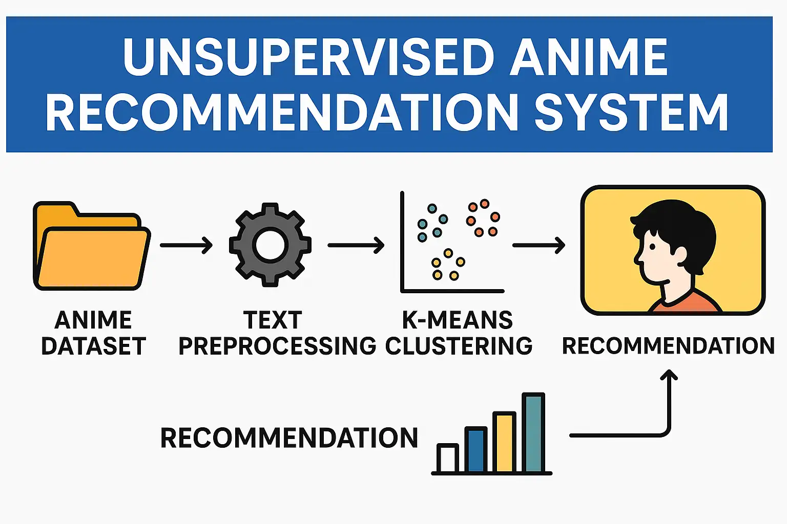
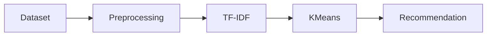

# 🎌 Ani Compass

> A machine learning–based anime recommendation system that helps users discover anime based on their preferences.

<p align="center">
  
</p>

## ✨ Features

- Content-based anime recommendations
- K-Means clustering
- TF-IDF synopsis vectorization
- Fuzzy matching for typo handling
- No user watch history required

## 🏗️ Workflow



## 📂 Dataset

Based on the **Top 15,000 Ranked Anime Dataset** from Kaggle.

Modifications:
- Renamed to `anime_2025.csv`
- Removed the `japanese_name` column

## 🚀 Getting Started

```bash
git clone https://github.com/udaycodespace/ani-compass.git
cd ani-compass
```

Open:

```text
notebooks/Unsupervised_Anime_Recommendation_System.ipynb
```

Example:

```python
get_recommendations("Naruto")
get_recommendations("Bleach")
get_recommendations("Bleech")  # typo handling
```

## ⚙️ Tech Stack

- Python
- Pandas
- NumPy
- Scikit-learn
- NLTK

## 📁 Project Structure

```text
ani-compass
├── datasets/
├── notebooks/
├── project-overview.webp
├── README.md
└── LICENSE
```

## 👨‍💻 Author

**Somapuram Uday**