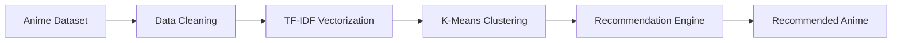
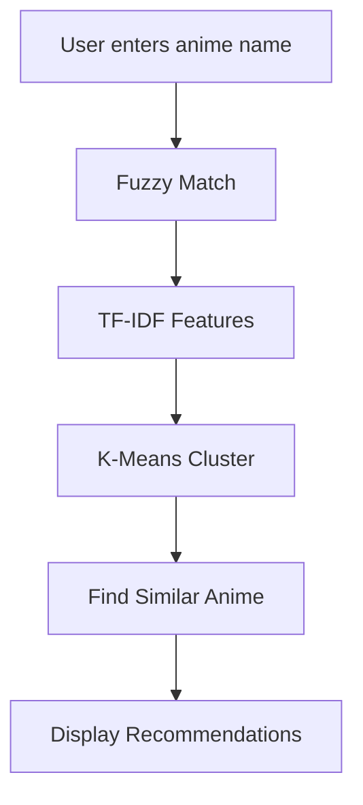
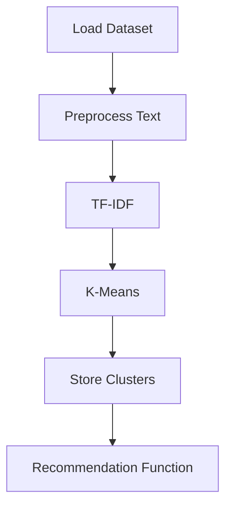
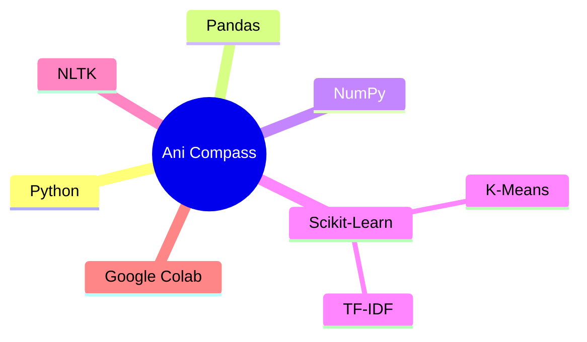
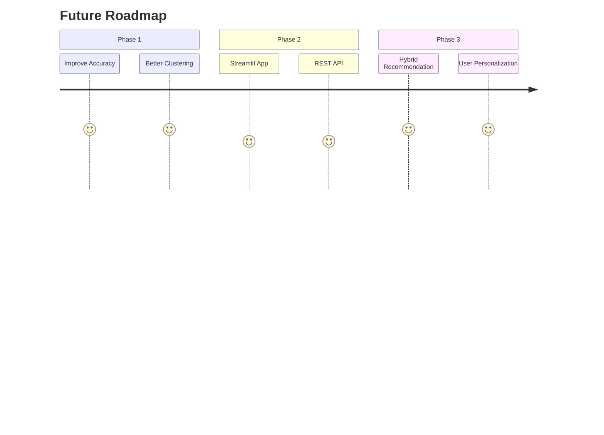

# 🎌 Ani Compass

> A machine learning–based anime recommendation system that helps users discover anime based on their preferences.

<p align="center">
  
</p>

---

## ✨ Features

- 🎯 Content-based anime recommendations
- 🧠 K-Means clustering
- 📝 TF-IDF synopsis vectorization
- 🔍 Fuzzy search for typo handling
- ⚡ Fast recommendations without user history

---

# 🏗️ System Architecture



---

# 🔄 Recommendation Pipeline



---

# 🧠 Machine Learning Workflow



---

# 📂 Dataset

📦 **Top 15,000 Ranked Anime Dataset**

**Modifications**
- Renamed to `anime_2025.csv`
- Removed `japanese_name`

---

# 🚀 Run

```bash
git clone https://github.com/<username>/ani-compass.git

cd ani-compass
```

Open

```
Unsupervised_Anime_Recommendation_System.ipynb
```

Run

```python
get_recommendations("Naruto")

get_recommendations("Bleach")

get_recommendations("Bleech")   # typo handling
```

---

# ⚙️ Tech Stack



---

# 📁 Project Structure

```text
ani-compass
│
├── ani-compass/
│   └── project-overview.webp
│
├── dataset/
│   └── anime_2025.csv
│
├── Unsupervised_Anime_Recommendation_System.ipynb
├── README.md
└── LICENSE
```

---

# 🚀 Future Improvements



---

# 👨‍💻 Author

**Somapuram Uday**